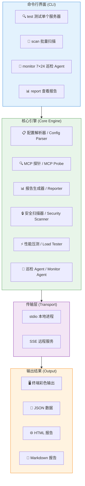

# MCP Sentinel

**Postman for MCP** — discover, probe, and monitor Model Context Protocol servers.

A CLI tool that validates MCP protocol compliance, checks tool availability, measures performance, and scans for security vulnerabilities. Works with local stdio servers and remote SSE endpoints.

[](https://opensource.org/licenses/Apache-2.0)
[](https://nodejs.org/)

---

## Quick Start

```bash
# 1. Clone
git clone https://github.com/DevoutZhu/mcp-sentinel.git
cd mcp-sentinel

# 2. Install & build
pnpm install && pnpm build

# 3. Run your first check
node packages/cli/dist/index.js test --help
```

> **Prerequisites**: Node.js >= 20, pnpm >= 9

---

## Features

| # | Capability | What it checks |
| --- | --- | --- |
| Connectivity | Can the client reach the server? | Tests stdio spawn and SSE handshake, measures latency |
| Protocol | Does the server speak MCP correctly? | Validates initialize handshake, capabilities, version negotiation |
| Tools | Are the tools working? | Lists registered tools, validates input schemas, calls tools to verify |
| Performance | How fast is it under load? | Concurrent load testing with latency percentiles (p50/p95/p99) and throughput |
| Security | Are there OWASP LLM risks? | Scans for SSRF, prompt injection, PII leaks, unbounded output, missing auth |

---

## Commands

| Command | Purpose |
| --- | --- |
| `test` | Test a single MCP server — connectivity, protocol, tools, performance, security |
| `scan` | Recursively discover `mcp.json` files in a directory and test all servers |
| `report` | View or export saved test reports (terminal, JSON, HTML) |
| `config` | Manage CLI defaults — timeout, concurrency, transport |
| `load-test` | Run concurrent load tests with latency percentiles and throughput metrics |

---

## Usage Examples

### test — validate a single server

```bash
$ mcp-sentinel test ./my-mcp-server

═══════════════════════════════════
  Testing MCP Server: ./my-mcp-server
═══════════════════════════════════

✔ Connected (234ms) via stdio
ℹ Protocol: 2024-11-05
ℹ Server: my-mcp-server v1.0.0
───────────────────────────────────
ℹ Score: 95/100
ℹ Rules: 18 passed, 1 failed, 19 total
───────────────────────────────────
✔ [R001] Protocol version declared — 2024-11-05
✔ [R002] Server info present — my-mcp-server v1.0.0
✔ [R003] Capabilities declared — tools
✘ [R004] Server name is valid — missing version in serverInfo
───────────────────────────────────
Overall: 18/19 passed (score 95)
```

```bash
# Remote SSE server
mcp-sentinel test https://mcp.example.com

# Machine-readable JSON
mcp-sentinel test ./my-server --format json

# Longer timeout for slow-starting servers
mcp-sentinel test ./my-server --timeout 15000
```

### scan — batch-test all servers in a directory

```bash
$ mcp-sentinel scan ./servers

═══════════════════════════════════
  Scanning: /home/user/servers
═══════════════════════════════════

✔ Found 3 mcp.json file(s)
✔ users/mcp.json — score 98/100
✔ orders/mcp.json — score 91/100
✘ search/mcp.json — connection failed

───────────────────────────────────
  Scan Summary
───────────────────────────────────
✔ Total:   3 server(s)
✔ Passed:  2
✘ Failed:  1
ℹ Avg Score: 63/100
ℹ Duration:  4.2s
```

### load-test — measure performance under load

```bash
$ mcp-sentinel load-test ./my-server -c 20 -d 10

═══════════════════════════════════
  Load Test: ./my-server
═══════════════════════════════════
ℹ Transport: stdio
ℹ Concurrency: 20
ℹ Duration: 10s
ℹ Per-request timeout: 10000ms

───────────────────────────────────
  Results
───────────────────────────────────
✔ Success Rate: 99.8%
ℹ Total Requests:  2,451
✔ Successful:       2,446
✔ Failed:           5

───────────────────────────────────
  Latency (ms)
───────────────────────────────────
  Min:  3
  Avg:  12
  P50:  10
  P95:  25
  P99:  48
  Max:  82

───────────────────────────────────
  Throughput
───────────────────────────────────
  245.1 req/s
  Concurrency: 20
  Duration:    10.0s

───────────────────────────────────
✔ Load test PASSED
```

```bash
# Ramp-up: find the performance inflection point
mcp-sentinel load-test ./my-server --ramp-up --ramp-max 100 --ramp-step 10
```

### config — manage defaults

```bash
# View current settings
mcp-sentinel config

# Set timeout globally
mcp-sentinel config set timeout 15000

# Set transport preference
mcp-sentinel config set transport stdio
```

Configuration precedence (highest first): CLI flags > `MCP_SENTINEL_*` env vars > `~/.mcp-sentinel/config.json` > built-in defaults.

### report — review test results

```bash
# Latest report in terminal
mcp-sentinel report

# Export as JSON
mcp-sentinel report --format json

# Export as standalone HTML
mcp-sentinel report --format html -o results.html
```

---

## Tech Stack

| Layer | Technology |
| --- | --- |
| Runtime | Node.js >= 20 |
| Language | TypeScript 5.7 |
| Package manager | pnpm 9 (workspace monorepo) |
| CLI framework | Commander 13 |
| Terminal UI | Chalk 5 + Ora 8 |
| MCP SDK | `@modelcontextprotocol/sdk` 1.18 |
| Schema validation | Zod 3.24 |
| Testing | Vitest 3 |
| Build | `tsc` (TypeScript compiler) |

---

## Architecture / 系统架构



```
mcp-sentinel/
├── packages/
│   ├── core/          # Protocol validation engine + security scanner
│   │   └── src/
│   │       ├── rules/         # Protocol compliance rules (19 rules)
│   │       ├── validator.ts   # MCP init + tool validation
│   │       ├── security-scanner.ts  # SSRF, prompt injection, PII, DoS
│   │       ├── load-tester.ts # Concurrent load + ramp-up testing
│   │       ├── probe.ts       # MCP server connectivity probe
│   │       ├── parser.ts      # mcp.json config parser
│   │       └── reporter.ts    # Structured report generation
│   └── cli/           # Command-line interface (5 commands)
│       └── src/
│           ├── commands/      # test, scan, report, config, load-test
│           └── utils/         # Logger, spinner, probe helper
├── docs/               # Design documents
└── CLAUDE.md           # Project charter
```

---

## Installation

> npm package coming soon.

```bash
# From source (current)
git clone https://github.com/DevoutZhu/mcp-sentinel.git
cd mcp-sentinel && pnpm install && pnpm build

# From npm (future)
npm install -g mcp-sentinel
```

---

## License

Apache-2.0 — see [LICENSE](LICENSE) for details.

---

## 中文说明

**MCP Sentinel** 是一个 MCP（Model Context Protocol）服务器测试工具，相当于 MCP 世界的 Postman。

### 快速开始

```bash
git clone https://github.com/DevoutZhu/mcp-sentinel.git
cd mcp-sentinel && pnpm install && pnpm build
node packages/cli/dist/index.js test --help
```

### 核心能力

| 能力 | 说明 |
| --- | --- |
| 连通性检查 | 测试 stdio/SSE 连接是否正常，测量延迟 |
| 协议合规 | 验证 MCP 握手、版本协商、能力声明是否符合规范（19 条规则） |
| 工具可用性 | 列出并调用服务器注册的工具，验证输入输出 |
| 性能压测 | 并发负载测试，输出 p50/p95/p99 延迟及吞吐量 |
| 安全扫描 | 检测 SSRF、提示注入、PII 泄露、无界输出、缺少鉴权等 OWASP LLM 风险 |

### 命令一览

| 命令 | 用途 |
| --- | --- |
| `test` | 测试单个服务器（连通性 + 协议 + 工具 + 安全） |
| `scan` | 递归扫描目录下所有 `mcp.json`，批量测试 |
| `report` | 查看/导出测试报告（终端/JSON/HTML） |
| `config` | 管理默认配置（超时、并发、传输模式） |
| `load-test` | 并发压测，支持渐进式 ramup-up 找拐点 |

### 技术栈

| 层 | 技术 |
| --- | --- |
| 运行时 | Node.js >= 20 |
| 语言 | TypeScript 5.7 |
| 包管理 | pnpm 9（workspace monorepo） |
| CLI 框架 | Commander 13 |
| 终端输出 | Chalk 5 + Ora 8 |
| MCP 协议 | `@modelcontextprotocol/sdk` 1.18 |
| 测试 | Vitest 3（43 个测试全部通过） |

### 安装方式

当前从源码安装，npm 包即将发布：`npm install -g mcp-sentinel`
